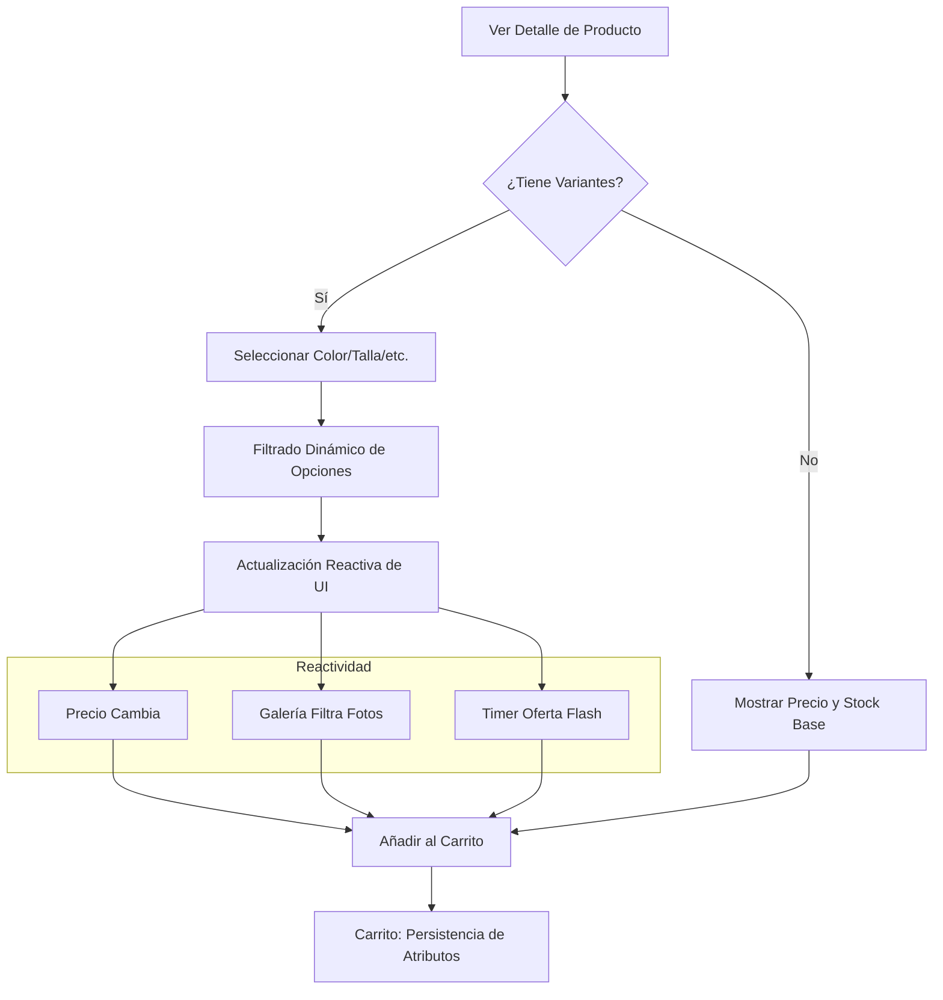

# Arquitectura de Datos y Variantes

Esta documentación describe el ecosistema de productos y variantes implementado para **Kuchas Kids**, enfocándose en la flexibilidad y escalabilidad.

## Esquema de Base de Datos (ER)

```mermaid
erDiagram
    PRODUCTS ||--o{ PRODUCT_VARIANTS : "tiene"
    ATTRIBUTES ||--o{ ATTRIBUTE_OPTIONS : "define"
    PRODUCT_VARIANTS }o--o{ ATTRIBUTE_OPTIONS : "se compone de"
    PRODUCTS ||--o? FLASH_OFFERS : "puede tener"
    PRODUCT_VARIANTS ||--o? FLASH_OFFERS : "puede tener"
    
    PRODUCTS {
        bigint id
        string name
        string slug
        string sku
        decimal price
        decimal offer_price
        int quantity
    }

    PRODUCT_VARIANTS {
        bigint id
        bigint product_id
        string sku
        decimal price
        decimal offer_price
        int stock
        json images
        boolean status
    }

    FLASH_OFFERS {
        bigint id
        string name
        morph_id offerable_id
        morph_type offerable_type
        decimal flash_price
        datetime start_at
        datetime end_at
        boolean status
    }

    ATTRIBUTES {
        bigint id
        string name
    }

    ATTRIBUTE_OPTIONS {
        bigint id
        bigint attribute_id
        string value
        string hex
    }
```

## Flujo de Frontend (UX/UI)

El proceso de compra sigue una lógica reactiva controlada por Livewire:



### Notas sobre la Implementación
1. **Flexibilidad:** El sistema permite añadir cualquier tipo de atributo sin cambiar la base de datos (Atributos > Opciones > Variantes).
2. **Reactividad Inteligente:** Al seleccionar un Color, las Tallas disponibles se filtran automáticamente para evitar selecciones de variantes sin stock.
3. **Persistencia Genérica:** El carrito guarda el `variant_id` y todos los atributos seleccionados como un array de opciones clave/valor, eliminando la necesidad de código específico para cada tipo de producto.
4. **Priorización de Ofertas:** 1. Oferta Flash Variante > 2. Oferta Flash Producto > 3. Oferta Normal > 4. Precio Base.
