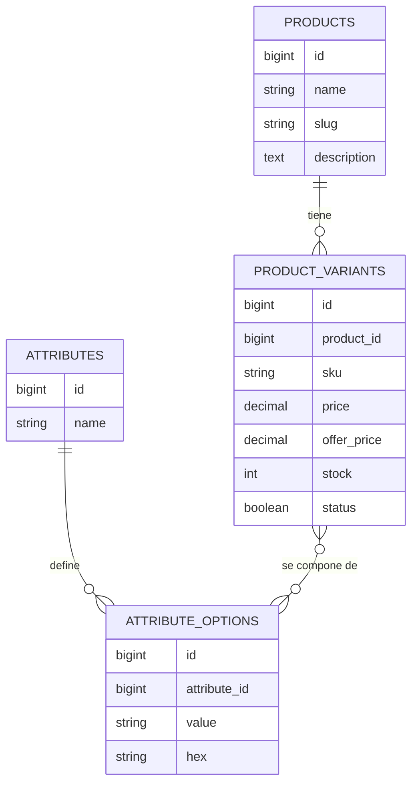
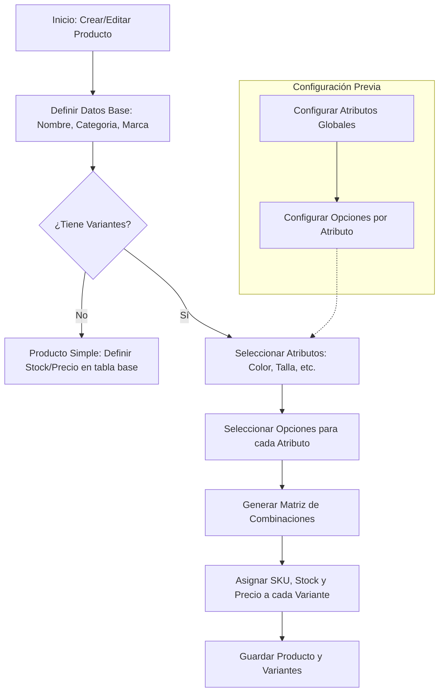

# Reestructuración de Productos y Variantes

Esta documentación describe el nuevo sistema de variantes dinámicas implementado para Kuchas Kids.

## Esquema de Base de Datos (ER)

## Flujo de Gestión (CRUD)

El siguiente diagrama describe cómo se gestionan los productos y sus variantes en el panel administrativo:

### Notas sobre la Implementación
1. **Flexibilidad:** El sistema permite añadir cualquier tipo de atributo (Material, Tipo de Cuello, etc.) sin cambiar la base de datos.
2. **Generación Automática:** Al seleccionar 2 colores y 3 tallas, el sistema Livewire generará automáticamente 6 filas de variantes.
3. **Escalabilidad:** Las variantes se guardan en su propia tabla, lo que facilita el control de stock preciso por cada combinación.
